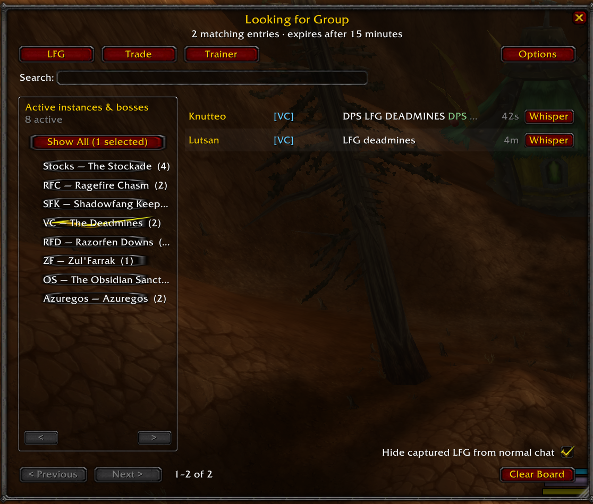
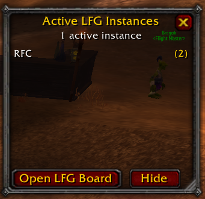
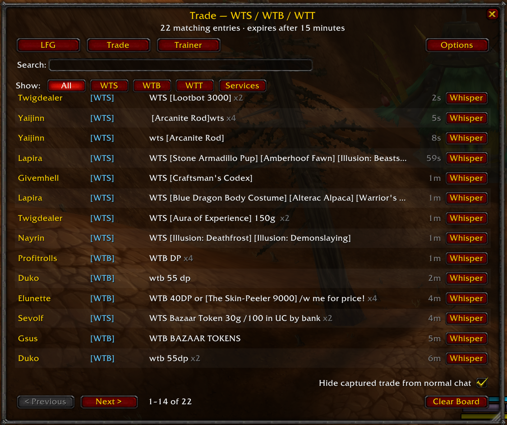
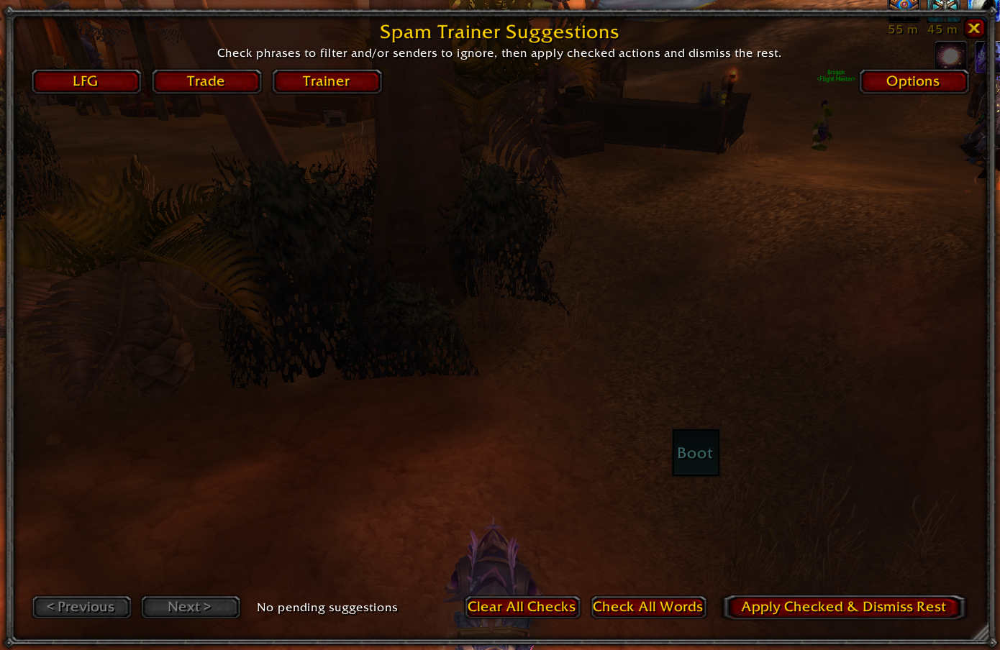
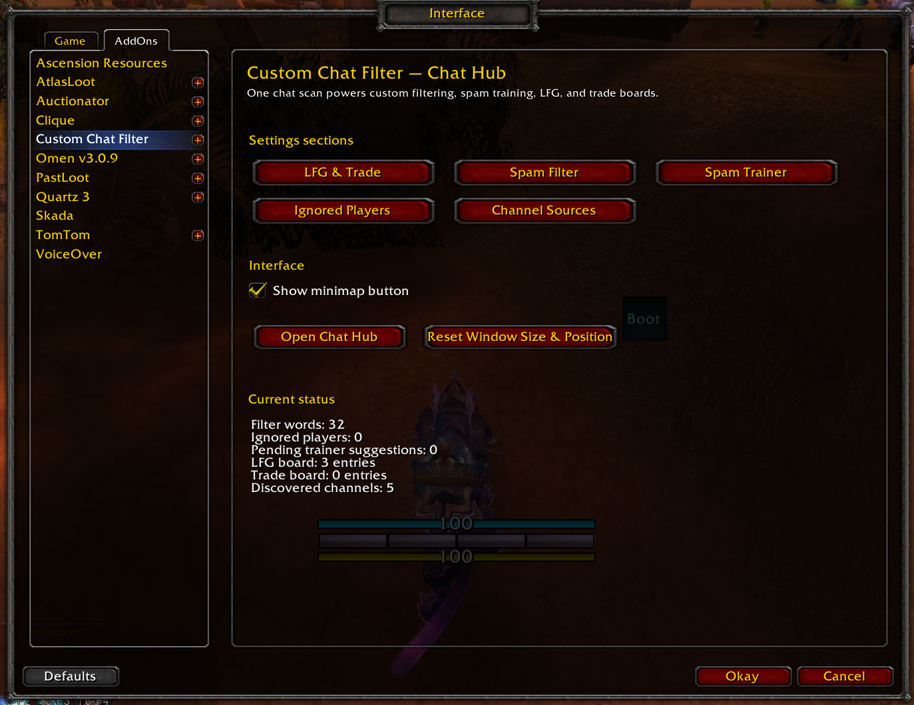
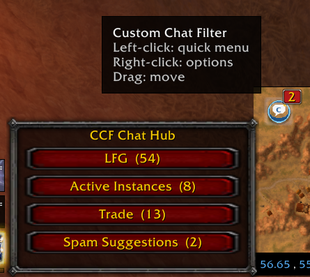

# CCF Chat Hub

An all-in-one chat-management addon for the original **World of Warcraft 3.3.5a** client.

CCF Chat Hub combines custom chat filtering, non-Latin script blocking, repeat-spam training, a structured Looking for Group board, and a categorized Trade board.

> **Compatibility:** Original WoW 3.3.5a client — Interface 30300  
> **Status:** Public beta  
> This is an unofficial community addon and is not affiliated with or endorsed by Blizzard Entertainment.

## Screenshots

<!-- Replace these filenames with the exact names of your screenshot files. -->
<!-- GitHub paths are case-sensitive. -->

### Looking for Group board



### Instance Tracker



### Trade board



### Spam Trainer



### Addon settings



### Minimap menu



## Features

### Custom chat filtering

- Add your own filtered words and phrases
- Case-insensitive literal matching
- Optional blocking of clearly non-Latin writing systems
- Separate controls for:
  - Say
  - Yell
  - Emotes
  - Whispers
  - Numbered and custom channels
- Individual Filter, Trainer, and Board controls for discovered channels

### Spam Trainer

- Detects repeatedly posted messages
- Default trigger: **4 matching posts within 90 seconds**
- Suggests distinctive words or phrases
- Never adds filters automatically
- Review suggestions using checkboxes
- **Apply Checked & Dismiss Rest** adds selected phrases, can ignore selected senders, and dismisses the others
- Detects repeated-word spam inside one message, such as `hello hello hello hello`
- LFG and Trade posts can be excluded from spam training

### Looking for Group board

- Captures LFG and LFM messages from chat
- Recognizes Classic, TBC, and Wrath instances
- Supports common dungeon and raid abbreviations
- Detects many raid and dungeon bosses
- Detects requested roles such as Tank, Healer, and DPS
- Detects 10-player and 25-player groups
- Detects Normal and Heroic difficulty
- Shows only instances and bosses with currently active board posts
- Searchable activity list
- One-click whisper button
- Repeated adverts are combined into one entry
- Boards start fresh on login and `/reload` by default
- Shows the board-session start time and most recent message time
- Active activities are ordered by current post count
- Newly active instances receive a short **NEW** marker in the standalone tracker
- Includes a compact, pinned Active Instances tracker window

### Trade board

- Captures:
  - WTS
  - WTB
  - WTT
  - Profession and service requests
- Searchable message list
- Separate category filters
- One-click whisper button
- Repeated adverts are combined into one entry
- Includes a one-click **Clear LFG + Trade** action

### Player ignore list

- CCF-specific account-wide player ignore list
- Ignore players directly from LFG/Trade rows
- Spam Trainer suggestions can add detected senders to the ignore list
- Optional filtering of ignored players in guild, party, raid, and battleground chat

### Interface

- Resizable Chat Hub window
- Remembers window size and position
- Movable minimap button
- Optional minimap-button hiding
- Separate AddOns settings pages for:
  - Spam Filter
  - Spam Trainer
  - LFG & Trade
  - Ignored Players
  - Channel Sources

## Installation

1. Download the latest release ZIP from the repository's **Releases** section.
2. Exit World of Warcraft completely.
3. Extract the `CustomChatFilter` folder into:

   ```text
   World of Warcraft\Interface\AddOns\
   ```

4. Confirm that the final path is:

   ```text
   World of Warcraft\Interface\AddOns\CustomChatFilter\CustomChatFilter.toc
   ```

5. Remove or disable the older standalone addon:

   ```text
   CustomChatFilter_SpamTrainer
   ```

   The Spam Trainer is now built into CCF Chat Hub.

6. Start WoW and enable **Custom Chat Filter** from the character-selection AddOns menu.

## Upgrading from an earlier version

1. Exit WoW completely.
2. Replace:

   ```text
   Interface\AddOns\CustomChatFilter
   ```

   with the folder from the new release.

3. Delete or disable:

   ```text
   CustomChatFilter_SpamTrainer
   ```

4. Start WoW.

Your existing custom word list should remain in the same SavedVariables database.

## Minimap controls

- **Left-click:** open the quick CCF menu
- **Right-click:** open CCF options
- **Drag:** reposition the minimap button

Hide the minimap button with:

```text
/ccf minimap hide
```

Restore it with:

```text
/ccf minimap show
```

## Slash commands

```text
/ccf hub
/ccf lfg
/ccf trade
/ccf trainer

/ccf options
/ccf options filter
/ccf options trainer
/ccf options boards
/ccf options channels

/ccf add <word or phrase>
/ccf del <number or exact phrase>
/ccf list
/ccf test <message>

/ccf minimap show
/ccf minimap hide
/ccf active
/ccf active show
/ccf active hide

/ccf status
/ccf help
```

## LFG activity detection

The addon recognizes common names and abbreviations for Classic, The Burning Crusade, and Wrath of the Lich King content.

Examples include:

| Abbreviation | Activity |
|---|---|
| WC | Wailing Caverns |
| BRD | Blackrock Depths |
| ZF | Zul'Farrak |
| Kara | Karazhan |
| SSC | Serpentshrine Cavern |
| BT | Black Temple |
| UK | Utgarde Keep |
| HoL | Halls of Lightning |
| FoS | The Forge of Souls |
| PoS | Pit of Saron |
| HoR | Halls of Reflection |
| ICC | Icecrown Citadel |
| RS | The Ruby Sanctum |

Detection is based on chat text. Private-server communities may use abbreviations or wording that are not included yet.

## Known limitations

- This is a public beta and still needs testing across different servers and UI configurations.
- English cannot be reliably distinguished from other languages that use the Latin alphabet.
- Server-specific abbreviations may need to be added.
- Chat-text classification can occasionally miss unusual messages or produce false matches.
- Compatibility with every other chat-modification addon is not guaranteed.

## Troubleshooting

Enable Lua errors:

```text
/console scriptErrors 1
/reload
```

When reporting a problem, include:

- CCF version
- Server name
- Client language
- Screen resolution and UI scale
- Other installed chat addons
- Exact steps to reproduce the issue
- Complete Lua error message

## Reporting bugs and requesting features

Use the repository's **Issues** page for:

- Bug reports
- Missing instance or boss abbreviations
- Server-specific aliases
- Feature suggestions
- Compatibility problems

Please search existing issues before creating a new one.

## License

CCF Chat Hub is open-source software released under the [MIT License](LICENSE).
